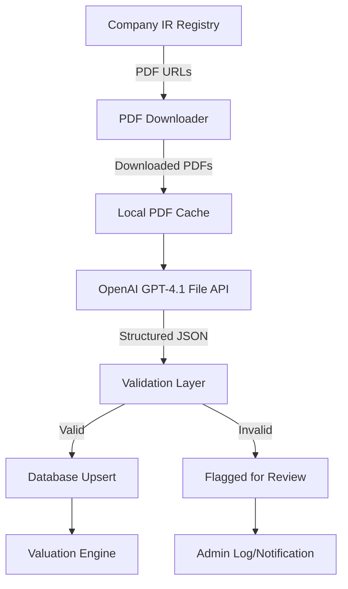
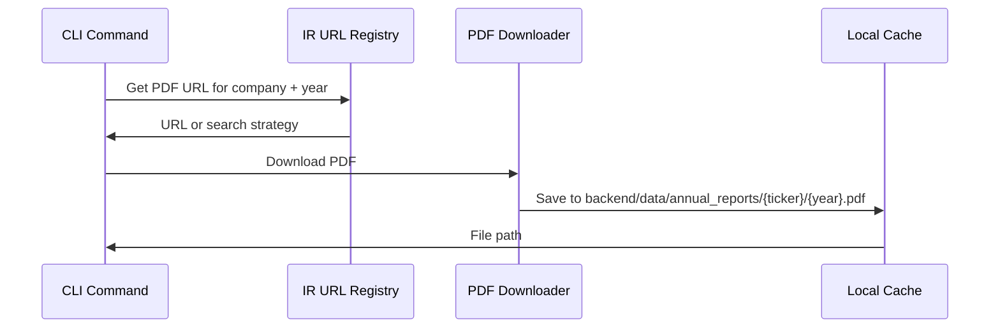
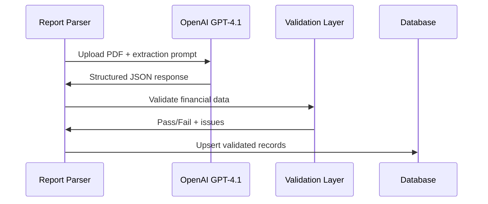

# Annual Report PDF Parser — Architecture Plan

## Overview

Replace kenyanstocks.com as the primary financial data source with **audited annual reports** extracted directly from company investor relations (IR) websites. Uses OpenAI GPT-4.1 to parse PDF annual reports and extract structured financial data.

## Architecture



## Data Flow

### Phase 1: PDF Discovery & Download



### Phase 2: PDF Parsing & Extraction



## Module Design

### New Files

| File | Purpose |
|------|---------|
| `backend/app/data/annual_report_parser.py` | Main module: PDF parsing, extraction, validation |
| `backend/app/data/ir_registry.py` | Company IR URL patterns and PDF discovery |
| `backend/app/data/pdf_downloader.py` | Download and cache PDF annual reports |
| `backend/data/annual_reports/` | Local PDF cache directory |

### Modified Files

| File | Changes |
|------|---------|
| `backend/app/models/company.py` | Add `investor_relations_url` column |
| `backend/alembic/versions/` | New migration for IR URL column |
| `backend/cli/commands.py` | Add `parse-annual-reports` command |
| `backend/tasks/valuation_tasks.py` | Add scheduled report parsing task |
| `backend/app/config.py` | Add `pdf_cache_dir` setting |

## Detailed Design

### 1. IR URL Registry (`ir_registry.py`)

NSE companies publish annual reports in predictable URL patterns. The registry maintains:

```python
IR_REGISTRY = {
    "KCB": {
        "ir_base": "https://kcbgroup.com/investor-relations/",
        "report_pattern": "annual-report-{year}",
        "pdf_search_strategy": "google_search",  # or direct_url
    },
    "SCOM": {
        "ir_base": "https://www.safaricom.co.ke/investor-relations/",
        "report_pattern": "annual-report-{year}",
        "pdf_search_strategy": "direct_url",
    },
    # ... 69 companies
}
```

For companies without direct PDF URLs, use a **Google search strategy**:
```
site:{company_domain} annual report {year} filetype:pdf
```

### 2. PDF Downloader (`pdf_downloader.py`)

```python
def download_annual_report(
    ticker: str,
    fiscal_year: int,
    *,
    cache_dir: str = "data/annual_reports",
    force_redownload: bool = False,
) -> str | None:
    """Download annual report PDF, return local file path.
    
    Strategy:
    1. Check local cache first
    2. Try direct URL from IR registry
    3. Fallback: use LLM to find the PDF URL
    4. Download and cache
    """
```

Cache structure:
```
backend/data/annual_reports/
├── KCB/
│   ├── 2020.pdf
│   ├── 2021.pdf
│   ├── 2022.pdf
│   ├── 2023.pdf
│   └── 2024.pdf
├── SCOM/
│   ├── 2020.pdf
│   └── ...
```

### 3. Annual Report Parser (`annual_report_parser.py`)

Core module that sends PDFs to OpenAI and extracts structured financial data.

```python
def parse_annual_report(
    pdf_path: str,
    ticker: str,
    fiscal_year: int,
) -> dict[str, Any] | None:
    """Parse a single annual report PDF using OpenAI GPT-4.1.
    
    Uses the OpenAI File API to upload the PDF, then sends a structured
    extraction prompt requesting specific financial statement figures.
    
    Returns validated financial data dict or None on failure.
    """

def parse_all_reports(
    db: Session,
    tickers: list[str] | None = None,
    years: range = range(2020, 2026),
    delay: float = 5.0,
) -> dict[str, Any]:
    """Parse annual reports for all companies across all years."""
```

### 4. OpenAI Integration

Uses the **Assistants API with file search** or **Chat Completions with file uploads**:

```python
def _extract_financials_from_pdf(pdf_path: str, ticker: str, year: int) -> dict:
    """Upload PDF to OpenAI and extract financials."""
    import openai
    
    client = openai.OpenAI(api_key=settings.openai_api_key)
    
    # Upload file
    with open(pdf_path, "rb") as f:
        file = client.files.create(file=f, purpose="assistants")
    
    # Create extraction request
    response = client.chat.completions.create(
        model="gpt-4.1",
        messages=[
            {"role": "system", "content": EXTRACTION_SYSTEM_PROMPT},
            {"role": "user", "content": [
                {"type": "file", "file": {"file_id": file.id}},
                {"type": "text", "text": EXTRACTION_USER_PROMPT.format(
                    ticker=ticker, year=year
                )},
            ]},
        ],
        temperature=0.0,
    )
    
    # Cleanup uploaded file
    client.files.delete(file.id)
    
    return _parse_response(response.choices[0].message.content)
```

### 5. Extraction Prompt

```
You are extracting EXACT financial figures from an audited annual report PDF 
for {company_name} (NSE: {ticker}), fiscal year ending {year}.

Extract these figures from the AUDITED financial statements (not management 
commentary or estimates):

FROM THE CONSOLIDATED INCOME STATEMENT:
- Total revenue / Total interest income (for banks)
- Profit for the year (attributable to shareholders)
- Basic earnings per share

FROM THE CONSOLIDATED BALANCE SHEET / STATEMENT OF FINANCIAL POSITION:
- Total assets
- Total liabilities
- Total equity (attributable to shareholders)
- Shares outstanding (from notes or face of balance sheet)

FROM THE CONSOLIDATED CASH FLOW STATEMENT:
- Net cash from operating activities
- Purchase of property, plant and equipment (as positive number)
- Free cash flow (= operating cash flow - capital expenditures)

FROM NOTES OR SUPPLEMENTARY DATA:
- Dividends per share declared/paid
- Return on equity (compute: net income / total equity)
- Debt to equity ratio (compute: total liabilities / total equity)

CRITICAL:
- Report EXACT figures from the audited statements
- All figures in KES (full numbers, e.g., 298500000000 for KES 298.5B)
- If a figure is not present in the PDF, return null (do NOT estimate)
- FCF = Operating cash flow - CapEx (compute from the two values above)
- Page numbers where you found key figures would be helpful

Return ONLY a JSON object...
```

### 6. Validation

Reuses `_validate_financial_record()` from `ai_enrichment.py` plus additional PDF-specific checks:

- Cross-reference revenue vs known company scale
- Verify balance sheet equation: Assets ≈ Liabilities + Equity
- Verify FCF = OCF - CapEx exactly
- Flag if extracted year doesnt match requested year

### 7. DB Upsert Strategy

PDF-sourced data is considered **highest quality** and will:
- Overwrite existing AI-sourced data (notes contain `[AI...]`)
- Overwrite existing kenyanstocks.com data
- NOT overwrite manually entered data (entered_by_user_id is set)
- Tag records with `notes = "[PDF extracted FY{year}]"`

### 8. CLI Commands

```bash
# Parse reports for specific companies
python -m cli.commands parse-annual-reports --tickers KCB,EQTY,SCOM

# Parse all available reports
python -m cli.commands parse-annual-reports

# Download PDFs only (no parsing)
python -m cli.commands download-reports --tickers KCB --years 2020-2024

# Recompute valuations after parsing
python -m cli.commands compute-valuations
```

### 9. Company Model Migration

```sql
ALTER TABLE companies ADD COLUMN investor_relations_url VARCHAR(500) NULL;
```

## Configuration

Add to `backend/app/config.py`:

```python
# Annual Report Parser
pdf_cache_dir: str = "data/annual_reports"
pdf_download_timeout: int = 60
pdf_max_size_mb: int = 50
```

## Error Handling

| Scenario | Action |
|----------|--------|
| PDF not found at URL | Log warning, skip company/year |
| PDF too large (>50MB) | Skip, log |
| OpenAI cannot parse PDF | Retry once, then fallback to AI enrichment |
| Validation fails | Log details, do NOT write to DB |
| Balance sheet doesnt balance | Flag for review but still write |
| Rate limit hit | Exponential backoff with retry |

## Phased Rollout

1. **Phase 1 - Immediate**: Run `reenrich-financials` for all companies (Option A, already built)
2. **Phase 2 - Build**: Implement PDF parser pipeline (Option C)
3. **Phase 3 - Populate**: Download + parse reports for top 20 companies by market cap
4. **Phase 4 - Expand**: Extend to all 69 companies
5. **Phase 5 - Automate**: Celery task checks for new annual reports monthly

## Dependencies

```
# Already in requirements.txt
openai>=1.0

# May need to add
pypdf>=3.0  # For PDF metadata extraction / page count check before upload
```

## Cost Estimate

- OpenAI GPT-4.1 file processing: ~$0.05-0.15 per PDF (depends on page count)
- 69 companies × 5 years = 345 PDFs
- Estimated total: ~$17-50 one-time cost for full backfill
- Monthly ongoing: ~$3-7 (69 new reports/year ÷ 12 months)
