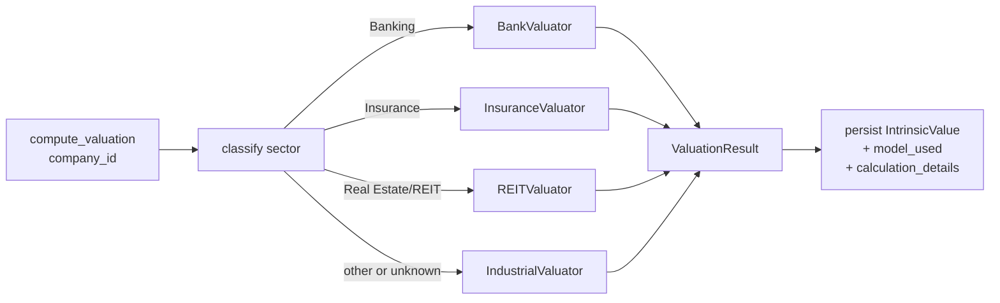

# StockUp — Sector-Specific Valuation Models

## Motivation

The current valuation engine ([backend/app/services/valuation_engine.py](../backend/app/services/valuation_engine.py))
applies a single DCF/EPV/BV pipeline to every listed company. This produces
defensible numbers for industrial businesses but breaks catastrophically for
banks, insurers and REITs — most visibly for KCB, where the engine currently
reports an intrinsic value of ~KES 1,083 against a market price of KES 94,
implying an implausible 91% margin of safety.

The root cause is not a bug in the DCF math; it is that **the model has no
concept of business type**. It reads free cash flow, capex and total
liabilities the same way for a bank as it does for a cement maker. For banks:

- Customer deposits are the raw material of the business, not "debt".
- Free cash flow is not a meaningful proxy for owner earnings.
- Value creation is measured by the spread between ROE and cost of equity,
  not by discounting projected FCFs.

This plan replaces the monolithic engine with a **sector dispatcher plus
pluggable valuation strategies**, starting with banks (Phase 1) and extending
to insurance and REITs (Phases 2–3).

---

## Guiding principles

1. **Same public API.** `valuation_engine.compute_valuation(db, company_id)`
   remains the entry point. Everything downstream (`analysis` router, Celery
   tasks, CLI) works unchanged.
2. **Same persistence shape.** `intrinsic_values` keeps its `dcf_value`,
   `epv_value`, `book_value_estimate`, `weighted_intrinsic_value` columns. For
   non-industrial strategies these columns hold the strategy's three
   primary/secondary/tertiary component values so the current frontend
   continues to render.
3. **Full auditability.** The specific model used, its inputs, and its
   scenario outputs are recorded in `intrinsic_values.calculation_details`
   (JSON) plus a new `model_used` column so users can see *why* the number is
   what it is.
4. **Fail soft.** A strategy that lacks the sector-specific inputs it needs
   falls back to the industrial strategy with a warning, never crashes.

---

## Architecture

### Package layout

```
backend/app/services/valuation/
    __init__.py          # dispatch + public compute_valuation()
    base.py              # SectorValuator abstract base + shared types
    sectors.py           # sector-name → strategy classification
    industrial.py        # existing DCF + EPV + BV logic (extracted)
    bank.py              # Phase 1 — residual income + justified P/B + P/E
    insurance.py         # Phase 2 stub — embedded value + P/B
    reit.py              # Phase 3 stub — NAV + FFO multiple
```

`backend/app/services/valuation_engine.py` is kept as a thin re-export shim so
existing imports (`from app.services.valuation_engine import compute_valuation,
calculate_dcf, ...`) keep working during migration.

### Dispatch flow



### Strategy interface

```python
class SectorValuator(ABC):
    model_name: str  # e.g. "bank_residual_income"

    @abstractmethod
    def value(
        self,
        company: Company,
        financials: list[FinancialStatement],
        market_price: float | None,
        assumptions: dict[str, Any] | None = None,
    ) -> ValuationResult:
        ...
```

`ValuationResult` (already exists) gains three optional fields:

- `model_used: str` — e.g. `"bank_residual_income"`, `"industrial_dcf"`
- `scenario_values: dict[str, float]` — `{"conservative": ..., "base": ...,
  "strong": ...}` so the frontend can render a decision-range table
- `component_values: dict[str, float]` — for banks: `{"residual_income": ...,
  "justified_pb": ..., "justified_pe": ..., "dividend_discount": ...}`

---

## Phase 1 — Bank valuator (this iteration)

### Sector metrics captured

New JSON column `financial_statements.sector_metrics` (nullable) holds bank
line items without requiring hard schema changes for every sector:

```json
{
  "net_interest_income": 120000000000,
  "non_interest_income": 60000000000,
  "loan_loss_provisions": 25000000000,
  "gross_loans": 1200000000000,
  "non_performing_loans": 200000000000,
  "customer_deposits": 1600000000000,
  "net_interest_margin": 0.076,
  "cost_to_income": 0.48,
  "cost_of_risk": 0.028,
  "npl_ratio": 0.169,
  "capital_adequacy_ratio": 0.185,
  "tier1_ratio": 0.152,
  "loan_growth_pct": 0.10,
  "deposit_growth_pct": 0.08
}
```

All fields are optional. If NPL and CAR are missing the model still runs; it
just doesn't apply the quality discount.

### Formulas

Given latest reporting year: `BVPS_0`, `ROE_0`, `EPS_0`, `payout_ratio`,
`cost_of_equity r`, `terminal_growth g_T`.

**Sensible Kenyan-bank defaults:**

| Parameter | Default | Rationale |
|---|---|---|
| `cost_of_equity` | 0.145 | Risk-free ~13% (10Y KES bond) + 1.5% bank equity risk premium |
| `terminal_growth` | 0.05 | Long-term Kenyan nominal GDP proxy |
| `high_growth_years` | 5 | Explicit forecast horizon |
| `fade_years` | 5 | ROE fades from current to sustainable |
| `sustainable_roe` | max(r + 0.03, 0.15) | ROE bank can sustain long-term |
| `min_payout` | 0.25 | Bank must return some capital |
| `max_growth_cap` | 0.20 | Cap runaway growth |

**1. Two-stage residual income (primary weight 50%)**

$$
V_{RI} = BVPS_0 + \sum_{t=1}^{n} \frac{(ROE_t - r) \cdot BVPS_{t-1}}{(1+r)^t} + \frac{(ROE_T - r) \cdot BVPS_n}{(r - g_T)(1+r)^n}
$$

Where:
- ROE fades linearly from `ROE_0` (capped at 25%) to `sustainable_roe` over
  `high_growth_years + fade_years`.
- `BVPS_t = BVPS_{t-1} × (1 + ROE_t × (1 - payout))`.
- Retention capped so growth ≤ `max_growth_cap`.

**2. Justified price-to-book (weight 30%)**

$$
V_{P/B} = BVPS_0 \cdot \frac{ROE_{sustainable} - g_T}{r - g_T}
$$

Uses `sustainable_roe` (not current ROE) to avoid the "22% ROE forever"
trap. This is the number that most closely maps to the memo's base case.

**3. Justified price-to-earnings (weight 20%)**

$$
V_{P/E} = EPS_0 \cdot \frac{payout \cdot (1 + g_T)}{r - g_T}
$$

Cross-check via the Gordon growth model applied to dividends.

**Composite:** `V = 0.5 × V_RI + 0.3 × V_PB + 0.2 × V_PE`, then apply a
**quality discount** for asset-quality problems:

| Metric | Threshold | Discount |
|---|---|---|
| `npl_ratio > 0.10` | material | −5% |
| `npl_ratio > 0.15` | severe | −10% |
| `cost_of_risk > 0.02` | elevated | −5% |
| `capital_adequacy_ratio < 0.145` | tight capital | −10% |

Discounts are additive but capped at −25% (so a truly broken bank still gets
a value, not zero). Recorded in `calculation_details.quality_adjustments`.

**Scenarios** (rendered on the frontend as a decision-range table):

- **Conservative:** ROE fades to `r + 0.01`, payout = 0.4, r = 0.155
- **Base:** as-computed with defaults
- **Strong:** ROE fades to current, payout = 0.25, r = 0.135

### KCB validation target

Inputs from the memo:

- BVPS ≈ 103.15
- Current ROE ≈ 0.225
- EPS ≈ 22
- Payout ≈ 0.32 (KES 7 / KES 22)

Expected outputs:

| Scenario | Expected range |
|---|---|
| Conservative | KES 90 – 115 |
| Base | KES 120 – 155 |
| Strong | KES 150 – 200 |

Final composite (base case, post quality-discount) should land in **KES
120–160**, MOS at KES 94 market price = **20–40%**. Compare against current
engine output of KES 1,083 / MOS 91%.

### Sector-aware recommendation gates

`recommendation_engine.assess_quality` becomes sector-aware. For banks, the
following industrial factors are **replaced**:

| Industrial factor | Bank replacement |
|---|---|
| `has_low_leverage` (D/E < 0.5) | `has_adequate_capital` (CAR > 14.5% and Tier1 > 10.5%) |
| `has_conservative_debt` (Liab < 4×NI) | *removed* — meaningless for banks |
| `has_positive_fcf` | *removed* — replaced by `has_healthy_asset_quality` (NPL < 15% and CoR < 2.5%) |
| `has_fcf_increasing` | `has_earning_asset_growth` (loans+deposits growing) |
| `has_capital_efficiency` (FCF/Rev > 5%) | `has_efficient_operations` (cost_to_income < 55%) |

The 5-of-5 quality gate for "Buy" becomes 5 bank-specific factors:

1. ROE > 18% (higher bar for banks — they should earn a premium ROE)
2. Adequate capital (CAR > 14.5%)
3. Healthy asset quality (NPL < 15%)
4. Earning-asset growth (loans or deposits growing over 3+ years)
5. Efficient operations (cost-to-income < 55%)

For KCB with 22.5% ROE, ~18.5% CAR, 16.9% NPL, ~10% loan growth, high 40s
cost-to-income:

- ✅ ROE  ✅ Capital  ❌ NPL (just misses)  ✅ Growth  ✅ Efficiency

Result: 4/5 → `Accumulate` band. Consistent with the memo's "HOLD /
selectively accumulate on weakness."

---

## Phase 2 — Insurance valuator (later)

Formulas: embedded value approximation + P/B × (ROE − g)/(r − g) + P/E ×
combined-ratio adjustment. Sector metrics: combined ratio, loss ratio,
expense ratio, investment yield, embedded value.

## Phase 3 — REIT valuator (later)

Formulas: NAV per unit + FFO multiple + dividend discount. Sector metrics:
occupancy rate, rental income, FFO, NAV per unit, LTV.

---

## Migration plan

### Database

New Alembic migration `h0i1j2k3l4m5_add_sector_valuation_fields.py`:

- `financial_statements`: add `sector_metrics JSON NULL`
- `intrinsic_values`: add `model_used VARCHAR(40) NULL`
- `intrinsic_values`: add `scenario_values JSON NULL`

All nullable; no data migration required. Existing rows continue to work.

### Code

1. Extract current DCF/EPV/BV logic into `valuation/industrial.py`
   (near-verbatim move, preserves numeric behaviour for non-bank
   companies).
2. Add `valuation/base.py`, `sectors.py`, `bank.py`, package
   `__init__.py` with dispatcher.
3. Rewrite `valuation_engine.py` as a re-export shim that:
   - keeps existing top-level functions (`calculate_dcf`, `calculate_epv`,
     `calculate_book_value`, `calculate_weighted_intrinsic_value`,
     `calculate_margin_of_safety`, `DEFAULT_ASSUMPTIONS`,
     `ValuationResult`, `DCFResult`, etc.) importable at the old paths,
   - dispatches `compute_valuation` and `compute_all_valuations` via the
     new package.
4. Update `recommendation_engine.assess_quality` to accept a `sector`
   argument; add `_assess_bank_quality` for the bank-specific factor set.
5. Update `routers/analysis.py` to pass `company.sector` through to the
   recommendation engine.

### Tests

- `tests/test_valuation_engine.py` — existing tests keep passing (industrial
  strategy behaviour unchanged).
- `tests/test_bank_valuator.py` — new tests:
  - KCB-like inputs land in the 120–160 base-case range
  - Missing sector_metrics still produces a value (falls back to no quality
    discount, doesn't crash)
  - Company with `sector="Manufacturing"` never routes to bank strategy
  - Scenario values are ordered `conservative < base < strong`

### Validation script

`backend/scripts/revalue_banks.py` — one-shot script the user can run
against the local Postgres to re-value KCB, Equity, Co-op, NCBA and print a
side-by-side comparison of old vs new values.

---

## Rollout

1. Ship migration + code + tests (this iteration).
2. Run `python -m app.scripts.revalue_banks` locally, verify numbers.
3. If numbers look good, run `celery -A tasks.valuation_tasks
   compute_all_valuations` to refresh all bank valuations in DB.
4. Frontend keeps working immediately (same `ValuationResponse` shape). A
   later frontend PR can surface `model_used` and `scenario_values` in the
   Company Detail page.
5. Phase 2 (insurance) once bank valuator has been in production for a
   couple of weeks and confirmed stable on all four bank holdings.

---

## Open questions

- **Preferred `cost_of_equity` for Kenyan banks?** Draft uses 14.5%. Some
  argue for 16% given frontier-market risk. Made configurable via
  assumptions.
- **Do we recompute historical valuations?** Currently no — new valuations
  only. Old rows keep their `model_used = NULL` and remain queryable.
- **How do we handle KCB's pre-merger years?** For now, use whatever data
  is in `financial_statements`. If the user later ingests pre-2015 KCB
  data, the valuator will use it automatically.
